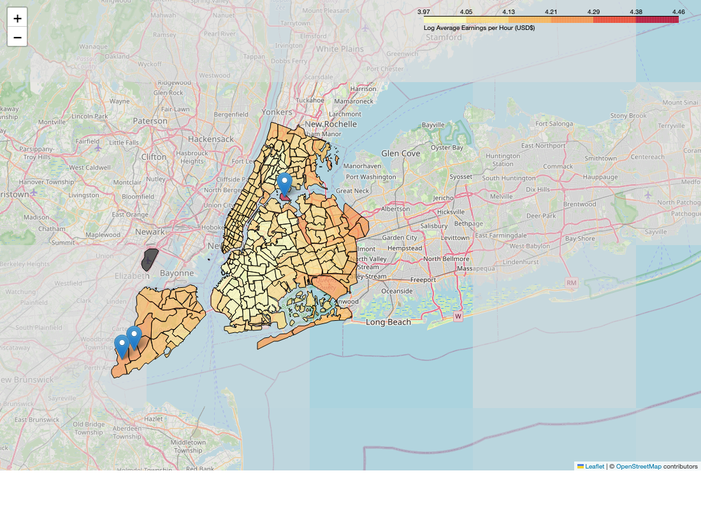
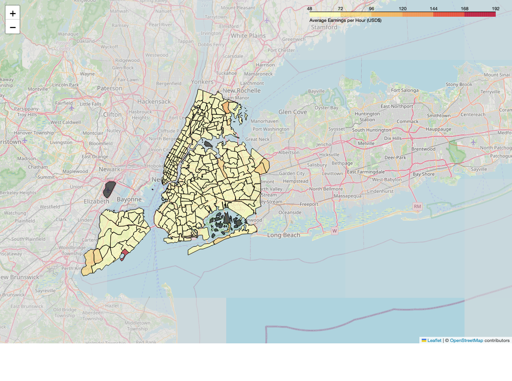
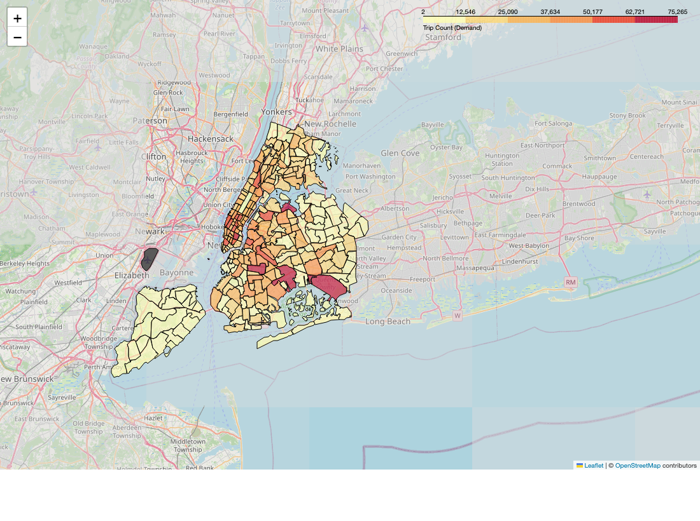

# NYC Rideshare Earnings Prediction

> Rideshare drivers make positioning decisions every shift with little visibility into where the system is actually paying out. This project uses ~105 million public NYC TLC trip records (May–November 2023) to model hourly driver earnings and ask how far public data alone can close that gap.



*Log average earnings per hour by NYC taxi zone.*

---

## Results

| Model | RMSE | R² |
|---|---|---|
| **Linear Regression** | **$4.88** | **0.850** |
| Lasso Regression (L1, λ=1) | $5.42 | 0.815 |

## Key Findings

The linear baseline is solid (R² = 0.85). The more useful insights are in where it falls short:

- **Airport zones dominate, but the headline hides the deadhead trip.** JFK, LGA and EWR have the highest gross hourly earnings by a wide margin, which is why the raw choropleth needs a log scale to show anything else. Discounting each pickup by the empty return drive could plausibly change which zone genuinely pays best on net earnings.
- **Earnings are bimodal, not flat across the day.** A sharp commuter peak from 5 to 8 AM and a broader peak from 10 PM to midnight bracket a clear afternoon trough. The two peaks behave like different markets (one inelastic, one weather- and nightlife-driven), which suggests a single global model is the wrong shape.
- **Uber edges Lyft on the median, but its low-tail runs longer.** Uber drivers more frequently log very low-earning hours, consistent with a more permissive matching policy that takes on low-value trips. Without platform-side data this cannot be cleanly separated from a driver-mix effect.
- **Weather is small in aggregate, probably large in interactions.** Feels-like temperature and precipitation move earnings only modestly when entered linearly. The effect almost certainly lives in interactions with zone and hour (snow at the airports, rain on Friday nights), which the current linear model cannot recover.

---

## Visualisations

**Earnings per hour, Uber vs Lyft**


**Average earnings per hour by hour of day**


**Geospatial maps**

| | |
|---|---|
|  |  |
| **Average earnings per hour.** Raw choropleth. Airport zones dominate the colour scale, washing out the rest. | **Log average earnings per hour.** Log-scaled version surfaces variation across mid-range zones. |
|  | |
| **Trip-count demand.** Pickup-volume heatmap across the five boroughs. | |

> Interactive folium versions of the maps are available in [`plots/`](plots/) for local viewing.

---

## Methodology

```
NYC TLC (FHVHV)          External Data
May–Oct 2023       ──┐   (weather, holidays,
                      ├──► Preprocessing ──► Feature Engineering ──► Model Training
Nov 2023 (holdout) ──┘   taxi zone shapefiles)                            │
                                                                           ▼
                                                                     Evaluation +
                                                                     EDA / Maps
```

**Features.** One-hot encoded license type (Uber/Lyft), standardised trip distance, day-of-week and hour-of-day encodings, pickup-zone encoding (NYC taxi zones), weather conditions (feels-like temperature, precipitation type/amount), and a public-holiday indicator.

## Engineering Decisions

- **Drop fee-correlated columns before any feature engineering.** The raw TLC schema exposes `base_passenger_fare`, `tolls`, `bcf`, `sales_tax`, `congestion_surcharge` and `airport_fee` — all post-trip outputs that sit in tight arithmetic relation to the `driver_pay + tips` earnings label. Leaving any of them in the feature set would let the linear regression reconstruct the label by addition and report an inflated R². They are removed in [`DROP_COLUMNS_INITIAL`](scripts/preprocessing.py) up front, so the model only sees inputs that would actually be available at trip-start time (license, location, time, distance, weather, holiday).
- **Temporal holdout, not a random split.** Random shuffling would leak day-of-week and seasonal structure from train into test and inflate apparent accuracy. November 2023 is held out whole and the model is trained on May–October in [`temporal_split`](scripts/modelling.py), so the headline RMSE/R² reflect forward-in-time generalisation — the regime any deployed version of this model would face.
- **Sample-size-scaled IQR threshold for outlier removal.** The textbook `1.5 × IQR` rule strips a large share of genuine high-value trips at the ~100M-row FHVHV scale. The project's [`apply_iqr_rule`](scripts/functions.py) substitutes a `(√log(N) − 0.5) × IQR` multiplier that widens with `N` (≈3.8× IQR at N=100M vs the classical 1.5×), and clips the lower bound at zero because earnings and distance cannot be negative. Applied to `trip_miles`, `trip_time`, `tips`, `driver_pay`, `earnings` and `earnings_per_hour`.
- **Outlier filter intentionally skipped for weather.** The same IQR rule is deliberately not applied to the weather frame in [`clean_weather`](scripts/preprocessing.py). NYC feels-like temperature and precipitation are domain-plausible end to end, and dropping hourly rows would punch holes in the trip-to-weather join — silently biasing the trip side rather than cleaning the weather side. The "do not filter here" choice is documented in the function so it survives later edits.
- **Curated schema canonicalised so vector columns survive Parquet round-trips.** PySpark `VectorUDT` columns (the one-hot vectors built during preprocessing) do not survive a schema-inferring re-read of Parquet; without an explicit schema the downstream `VectorAssembler` breaks. The schema is declared once in [`spark.CURATED_SCHEMA`](scripts/spark.py) and reused by [`io_utils.load_curated()`](scripts/io_utils.py), so the analysis and modelling notebooks reload the curated data without rebuilding any encoders.

---

## Tech Stack

| Tool | Purpose |
|---|---|
| **PySpark 3.5** | Distributed data processing and ML |
| pandas / NumPy | Local data manipulation and visualisation prep |
| geopandas + folium | Geospatial analysis and interactive choropleth maps |
| scikit-learn / XGBoost | Supporting modelling utilities |
| matplotlib / seaborn | Static visualisations |

---

## Data Source

[NYC TLC For-Hire Vehicle High-Volume trip records](https://www.nyc.gov/site/tlc/about/tlc-trip-record-data.page). Publicly available monthly Parquet files. Only FHVHV records (Uber: `HV0003`, Lyft: `HV0005`) are used.

External datasets: hourly NYC weather data (May 2023 to May 2024) and NYC public holiday calendar.

---

## Repo Layout

```
scripts/
├── download.py         CLI script that fetches raw FHVHV Parquet from NYC TLC
├── spark.py            Spark session factory + curated-data schema
├── io_utils.py         Load raw FHVHV / weather / holidays / curated Parquet
├── preprocessing.py    Cleaning, feature engineering, weather join, holiday flag
├── modelling.py        Feature assembly, temporal split, train, evaluate
├── visualisation.py    Geospatial choropleths, boxplot, hourly line plot
└── functions.py        IQR outlier rule, z-score standardisation, shape/null helpers

notebook/
├── preprocess.ipynb    Orchestrates the preprocessing pipeline
├── analysis.ipynb      Builds the maps and EDA plots
└── model.ipynb         Trains and evaluates Linear + Lasso models
```

## Setup

**Requirements:** Python 3.12, Java (for PySpark)

```bash
pip install -r requirements.txt
```

## Running the Pipeline

Run these steps in order:

1. **Download raw data**
   ```bash
   python scripts/download.py
   ```
   Downloads FHVHV Parquet files for May–November 2023 into `data/raw/`.

2. **Preprocess.** See [`notebook/preprocess.ipynb`](notebook/preprocess.ipynb).
   Orchestrates `preprocessing.py` to clean and feature-engineer the trip data, join external weather and holiday data, and write curated month-partitioned Parquet to `data/curated/`.

3. **Analysis.** See [`notebook/analysis.ipynb`](notebook/analysis.ipynb).
   Calls `visualisation.py` to build folium choropleths and matplotlib charts. Outputs to `plots/`.

4. **Model.** See [`notebook/model.ipynb`](notebook/model.ipynb).
   Calls `modelling.py` to assemble features, temporally split, and train Linear and Lasso regressions evaluated on the November 2023 holdout.

---

## Future Improvements

- **Net-earnings reframing.** Discount each pickup by the deadhead return trip. This is the single follow-up most likely to overturn, rather than just refine, the current "best zone" ranking.
- **Regime-specific models.** Fit separate models for the commuter and nightlife peaks instead of averaging across both.
- **Non-linear baselines.** Benchmark XGBoost or LightGBM, primarily to test how much residual variance lives in weather-by-zone-by-hour interactions the linear model cannot capture.
- **Per-zone or per-borough models.** Exploit the spatial heterogeneity that the choropleths make obvious but the global fit ignores.
- **Platform-side data.** Surge multipliers and acceptance/rejection logs would separate algorithmic effects from driver-mix effects in the Uber/Lyft gap.
- **Real-time scoring.** Package the model behind a lightweight API for live by-zone-by-hour earnings estimates.

---

## Report

Full methodology, analysis and results write-up: [report/report.pdf](report/report.pdf).
